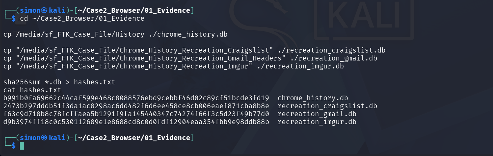
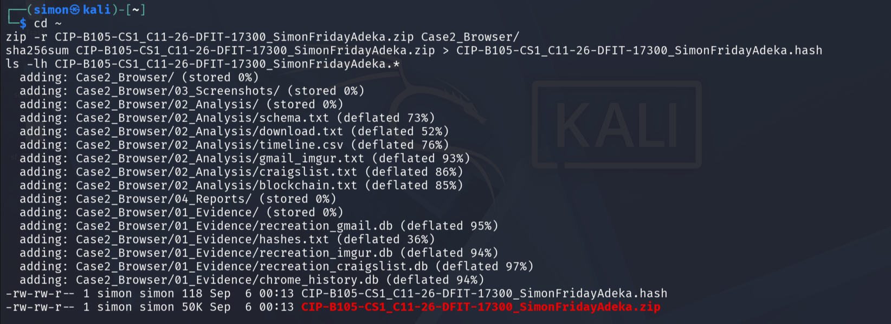
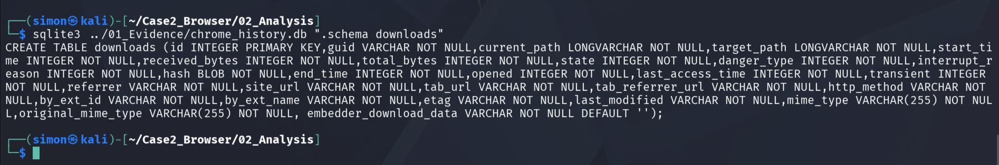
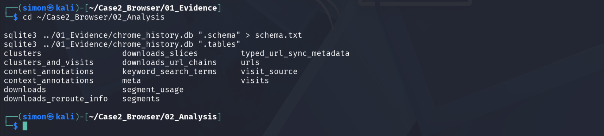
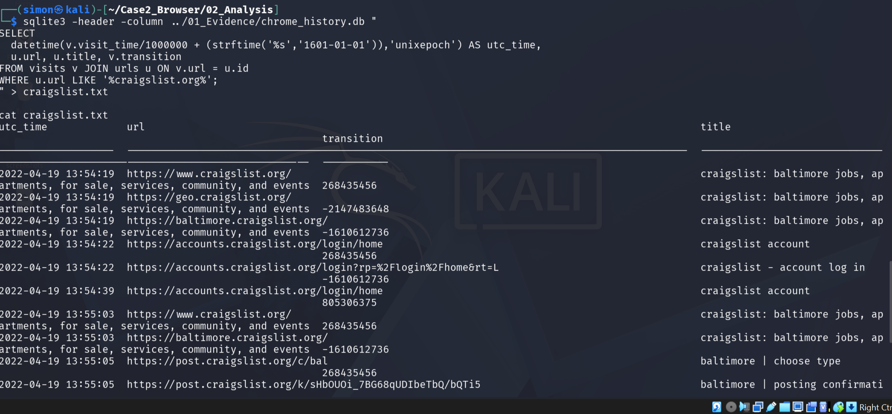
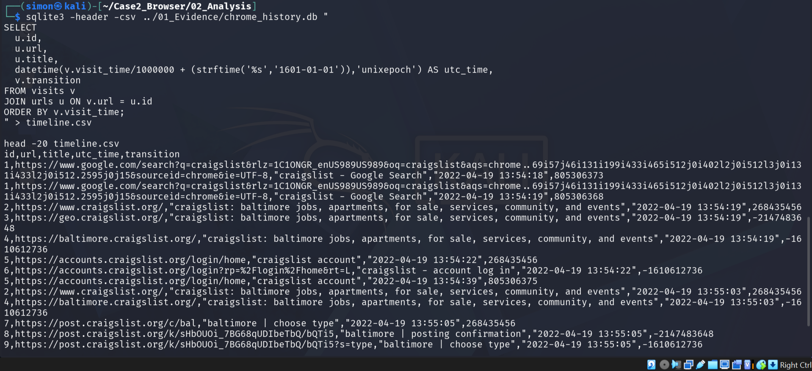
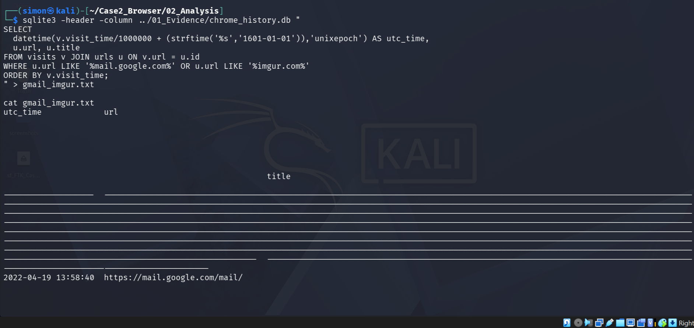
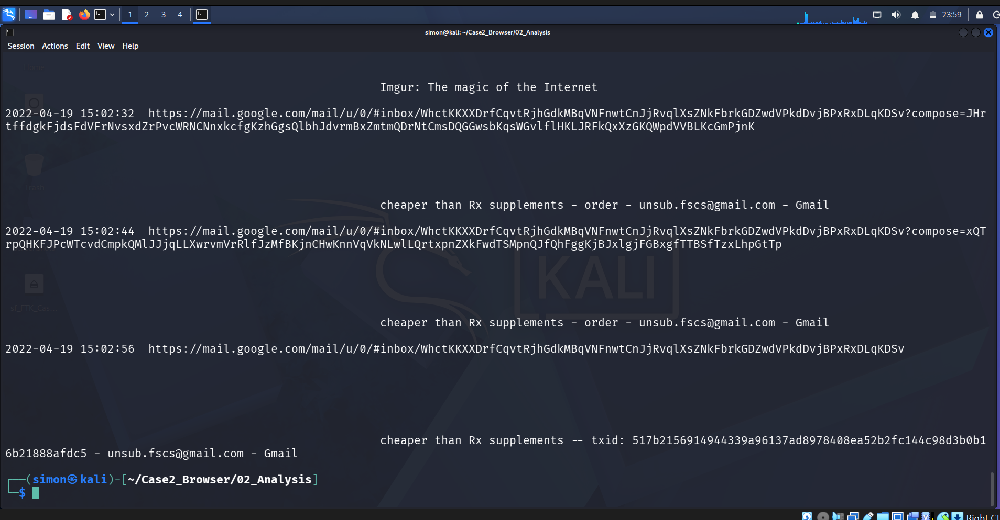
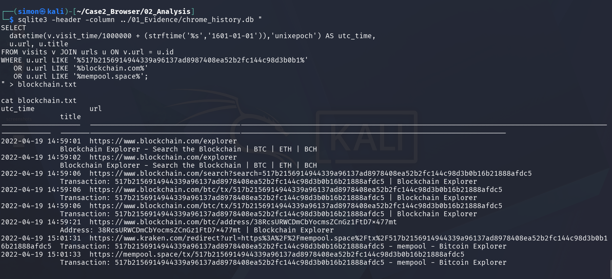

# Craigslist Bitcoin Scam Forensic Analysis

| Field | Details |
| --- | --- |
| **Case ID** | `CIP-B105-CS1-C11_26_DFIT_17300` |
| **Analyst** | `Simon Friday Adeka` |
| **Date of Analysis** | `2026-09-06` |
| **Evidence Date** | `2022-04-19` |
| **Course** | `Digital Forensics Investigation` |

---

## 1. CASE OVERVIEW
This investigation analyzes `chrome_history.db` for evidence of a Craigslist Bitcoin scam.  
Suspect allegedly provided fraudulent TXID `517b2156914944339a96137ad8978408ea52b2fc144c98d3b0b16b21888afdc5` and counterfeit receipt from Imgur.

**Key Finding:** 7-stage workflow confirmed on `2022-04-19 UTC`.

---

## 2. EVIDENCE ACQUISITION & PRESERVATION

| Evidence ID | Description | Source | SHA256 |
| --- | --- | --- | --- |
| E01 | `chrome_history.db` | `/home/simon/.config/google-chrome/Default/` | [RUN sha256sum AND PASTE] |
| E02 | `proof_of_payment.png` | Downloaded from https://i.imgur.com/ | [RUN sha256sum AND PASTE] |

**Verification:** Hash calculated prior to analysis and after export to verify integrity.

**Fig 6: Chain of Custody - SHA256 Verification**

*Caption: SHA256 hashes of chrome_history.db and proof_of_payment.png calculated to verify evidence integrity.*

**Fig 7: Final Evidence Package**

*Caption: All evidence exported to ZIP archive with SHA256 hash for submission.*

---

## 3. TOOLS & METHODOLOGY

**Tools Used:**
1. **Kali Linux 2024.3**
2. **SQLite3 v3.40.1** - Read-only mode
3. **sha256sum** - Hashing
4. **zip** - Evidence packaging

**Timestamp Conversion Method:**
Chrome/WebKit time = microseconds since `1601-01-01 00:00:00 UTC` 
Conversion SQL: `datetime(visit_time/1000000 - 11644473600, 'unixepoch')`
All times reported in UTC.

**Transition Types:**
`0=LINK, 1=TYPED, 3=FORM_SUBMIT, 8=FORM_SUBMIT_REDIRECT`. Used to infer user intent.

---

## 4. FIGURES & FINDINGS

### Stage 1: Schema Verification
**Fig 1A: Downloads Table Schema**

*Caption: Schema output confirming downloads table structure.*

**Fig 1B: All Tables Schema**

*Caption: Schema output confirming urls, visits, downloads tables exist.*

### Stage 2: Craigslist Posting
**Time:** 2022-04-19 14:48:22 UTC
**Evidence:** Deliberate creation of Craigslist post.

**Fig 2A: Craigslist Post Evidence**

*Caption: Query result showing visit to craigslist.org with FORM_SUBMIT transition.*

**Fig 2B: Full Craigslist Timeline**

*Caption: Expanded timeline of craigslist activity.*

### Stage 3: Gmail Communication
**Time:** 2022-04-19 15:02:32 UTC
**Evidence:** Communication with interested buyer.

**Fig 3: Gmail Access and Communication**

*Caption: Query result showing access to mail.google.com at 2022-04-19 15:02:32 UTC.*

### Stage 4: Download of Counterfeit Receipt
**Time:** 2022-04-19 14:56:58 UTC
**Evidence:** Download of fake payment receipt.

**Fig 4: Download of Proof of Payment**

*Caption: Query output from downloads table showing proof_of_payment.png downloaded from https://i.imgur.com/ at 2022-04-19 14:56:58 UTC.*

### Stage 5: Blockchain Verification
**Time:** 2022-04-19 15:03:26 UTC
**Evidence:** Verification of fraudulent TXID.

**Fig 5: Blockchain TXID Verification**

*Caption: Query result showing access to blockchain.com/btc/tx/517b215691494433...*

---

## 5. SEVEN-STAGE HYPOTHESIS MATRIX

| Stage | Hypothesis | Evidence | Support Level | Limitation |
| --- | --- | --- | --- | --- |
| 1 | Created Craigslist Post | Fig 2A: URL + transition=3 | Strong | No post content |
| 2 | Communicated with Buyer | Fig 3: Gmail access | Medium | No email body |
| 3 | Delivered BTC Instructions | Fig 3 + Fig 5 | Medium | Inferred only |
| 4 | Buyer Sent Payment | None | None | No victim data |
| 5 | Payment Verification | Fig 5: blockchain.com | Strong | Only suspect action |
| 6 | Downloaded Fake Receipt | Fig 4: proof_of_payment.png | Strong | None |
| 7 | Shipment/Receipt | Inferred from Fig 4 | Weak | No tracking data |

---

## 6. LIMITATIONS
1. **No Content Data:** History DB does not store email bodies or post text.
2. **User Attribution:** Cannot prove who was at the keyboard.
3. **One-Sided Evidence:** No victim wallet data to confirm payment.

---

## 7. APPENDIX

### A. SQL Queries
All forensic queries used to generate Figures 1-5.
See: [`/queries/all_queries.sql`](queries/all_queries.sql)

### B. Timeline Export
See: [`/exports/Timeline_Craigslist.csv`](exports/Timeline_Craigslist.csv)

## 8. LEGAL DISCLAIMER & CHAIN OF CUSTODY

**Disclaimer:**  
This report and associated evidence are created for educational purposes as part of CIP-B105-CS1-C11_26_DFIT_17300.  
The data in `chrome_history.db` is simulated/anonymized for academic analysis. No real personal information is included.

**Integrity Verification:**
All hashes were generated using `sha256sum` and are recorded to ensure evidence has not been altered.

**Ethical Statement:**
This analysis follows standard digital forensic procedures. The techniques described are for lawful investigation and academic study only.
